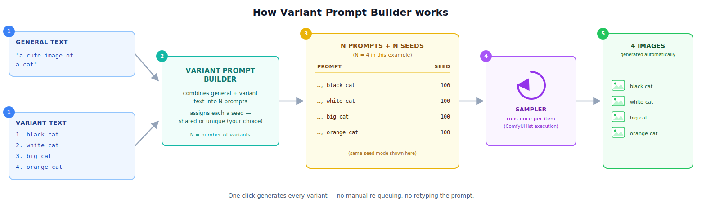

# ComfyUI Variant Prompt Builder

**Turn one prompt idea into a whole batch of images — automatically.**


A custom node + ready-to-use workflow for [ComfyUI](https://github.com/comfyanonymous/ComfyUI) that lets you describe several image variations in one text box and generate all of them in a single run — instead of manually editing and re-queuing the prompt for each one.

---

## What it does (in plain terms)

Say you want a picture of a cat in four different colors. Normally in an image-generation tool, you'd type the prompt, generate one image, then go back, edit the prompt, generate again — four separate times.

With this tool, you write it once:

- **General text:** `a cute image of a cat`
- **Variant text:** `1. black cat 2. white cat 3. big cat 4. orange cat`

Click generate once, and the workflow automatically produces **4 separate images** — one per variant — each built from the combined prompt (`"a cute image of a cat, black cat"`, `"a cute image of a cat, white cat"`, and so on).



You also control **whether the images should be visually comparable**: a "same seed" toggle either reuses the same starting randomness across every variant (so you can fairly compare, say, four cat colors under the same pose/lighting) or gives every image its own randomness for more variety.

---

## Why this is useful

Batch content generation — product variations, character concept exploration, marketing asset sets, A/B prompt testing — normally means either manually re-running a generation tool over and over, or writing custom automation from scratch. This project packages that automation into a single, reusable, drag-and-drop node that plugs directly into an existing production-grade image generation pipeline (ComfyUI + Flux), with no coding required to use it day-to-day.

---

## Example

| # | Combined prompt | Seed (same-seed **ON**) | Seed (same-seed **OFF**) |
|---|---|---|---|
| 1 | `a cute image of a cat, black cat`  | 100 | 100 |
| 2 | `a cute image of a cat, white cat`  | 100 | 101 |
| 3 | `a cute image of a cat, big cat`    | 100 | 102 |
| 4 | `a cute image of a cat, orange cat` | 100 | 103 |

More worked examples (including multiple images per variant) are in [`examples/example-prompts.md`](examples/example-prompts.md).

---

## Features

- **Two-field prompt design** — a `general_text` box for what stays constant, and a `variant_text` box for what changes.
- **Automatic batch size** — the number of images generated (`N`) is detected automatically from however many numbered variants you write; no separate counter to set.
- **Flexible variant formatting** — write variants inline (`1. a 2. b 3. c`) or one per line; a number that appears *inside* a variant's own description (e.g. "a cat with 3 legs") is correctly ignored, not mistaken for a new item.
- **`images_per_variant`** — generate more than one image per variant in the same run.
- **`use_same_seed` toggle** — matched seeds across variants (for controlled, side-by-side comparisons) or fully unique seeds (for maximum variety).
- **Drop-in integration** — works with ComfyUI's native list execution, so no loop nodes, subgraphs, or extra wiring are needed downstream of the node.
- **Tested** — a pytest suite covers the text-parsing and seeding logic (see [`tests/`](tests/)), run automatically on every push via GitHub Actions.

---

## How it works (technical overview)

ComfyUI can natively run a subgraph once per item in a list — if a node outputs a *list* instead of a single value, every downstream node automatically repeats for each list entry. This project uses that mechanism instead of building a custom loop:

1. The **Variant Prompt Builder** node parses `variant_text` for sequential numbered markers (`1.`, `2.`, `3.`, ...), combines each variant with `general_text`, and outputs a **list** of N prompts plus a matching **list** of N seeds.
2. That prompt list is wired into the workflow's existing `CLIPTextEncode` node, and the seed list into `RandomNoise`.
3. ComfyUI detects the list inputs and automatically re-runs the sampler → decode → preview chain once per entry — producing N images from a single queue action, with no changes needed anywhere else in the graph.

Full parsing rules and the exact seeding formulas are documented in the [node's own README](custom_nodes/comfyui-variant-prompt-builder/README.md).

---

## Repository structure

```
comfyui-variant-prompt-builder/
├── custom_nodes/
│   └── comfyui-variant-prompt-builder/   # the ComfyUI custom node (Python)
│       ├── __init__.py
│       ├── pyproject.toml                # optional, for Comfy Registry publishing
│       └── README.md                     # node-level technical reference
├── workflows/
│   ├── flux2-klein-9b-variant-prompt-workflow.json  # ready-to-load ComfyUI workflow
│   └── README.md
├── examples/
│   └── example-prompts.md                # worked input/output examples
├── tests/
│   └── test_variant_prompt_builder.py    # pytest unit tests
├── docs/
│   └── architecture-diagram.svg
├── .github/workflows/tests.yml           # CI: runs tests on every push
├── requirements-dev.txt
├── CHANGELOG.md
├── LICENSE
└── README.md
```

---

## Installation

**1. Get the custom node into ComfyUI**

Copy the `custom_nodes/comfyui-variant-prompt-builder` folder from this repository into your own ComfyUI installation's `custom_nodes/` directory, so you end up with:

```
ComfyUI/custom_nodes/comfyui-variant-prompt-builder/__init__.py
```

No `pip install` is required — the node only uses Python's standard library.

**2. Restart ComfyUI**

Fully restart the application (not just refresh the browser tab) so it picks up the new node.

**3. Load the workflow**

Open `workflows/flux2-klein-9b-variant-prompt-workflow.json` in ComfyUI. This requires a working Flux.2 Klein 9B model setup (checkpoint, CLIP, VAE) — the same requirements as ComfyUI's official single-prompt Flux.2 Klein 9B template, since this project only changes how the prompt and seed are supplied, not the model pipeline itself.

If you'd rather add the node to your own workflow by hand, it's available under **Add Node → utils → text → Variant Prompt Builder**.

---

## Running the tests

```bash
pip install -r requirements-dev.txt
pytest tests/ -v
```

---

## Skills demonstrated

*(for reviewers scanning this as a portfolio piece)*

- **Python development** — custom node architecture, regex-based text parsing, deterministic seed-generation logic.
- **Generative AI / diffusion pipelines** — hands-on work with Flux.2, and node-based visual workflow engineering in ComfyUI.
- **Software engineering practices** — unit testing (pytest), continuous integration (GitHub Actions), structured documentation, semantic versioning via `CHANGELOG.md`.
- **Workflow/graph automation** — programmatic manipulation of a JSON-based execution graph to add new automated behavior without disturbing the existing pipeline.

---

## Possible future improvements

- A UI-side character/token counter so long variant lists are easier to manage.
- Optional per-variant negative-prompt overrides.
- A variant-weighting syntax (e.g. `2x` a variant to bias sampling toward it).

---

## License

Released under the [MIT License](LICENSE).

## Author

**tablesizedogo** — [your.email@example.com](mailto:tablesizedogo@mail.ru) · [github.com/YOUR_USERNAME](https://github.com/tablesizedogo)
